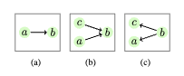

# Article: Directed connected operators: Asymmetric hierarchies for image filtering and segmentation

## Directed Connected Components

Given a graph $G$, we define a subset of vertices $X$ as a *Directed Connected Component* (or D-component) of a stating node $x$ as beind the set of all the successors of $x$ in $G$.

$DCC_G(x) = \{x, .., y\}\ | \bigvee\ i \in DCC_G(x),\ i \in S(x)$

In other words, the $DCC_G(x)$ can be interpreted as the set of all nodes "reachable" from the stating node $x$. 

In the example above for example (a), the $DCC_G(a) = \{a, b\}$, but the $DCC_G(b) = \{b\}$, only.

For example (b), the $DCC_G(\{a, b, c\}) = \{a, b\},\ \{b\}, \{c, b\}$, respectively.

And for example (c), the $DCC_G(\{a, b, c\}) = \{a\},\ \{b, a, c\}, \{c\}$, respectively.

## Strongly-connected Components

A subset $X$ of a graph $G$ is strongly connected if, for every pair $(x, y) \in X$, $x$ and $y$ are successors of each other.

$X \in SSC_G\ | \bigvee_{(x, y)} \in X, x \in DCC_G(y)\ \&\ y \in DCC_G(x)$

In other words, every node in a strongly connected component, succeed each other, and stating anywhere in this subset. can lead you to any other node.

One important property of a strongly connected set, is that is is "as big as it can be". That is, a strongly connected set cannot be part of a bigger connected set.

$X \neq Y\ \&\ X, Y \supset SCC_G \therefore X \nsubseteq Y\ \&\ Y \nsubseteq X$

ANother important caracteristic of $SCCs$ is that, because they are as big as they can be, the union of all possible $SCCs$ of a graph $G$ is equal to $G$ itself.

$G = \ X_1\ \cup\ X_2\ \cup\ \cdots\ \cup\ X_n,\ for\ (X_1, X_2, \cdots X_n) \in SCC_G$